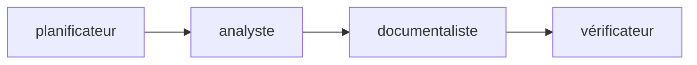

# Démonstration locale TCGA-LAML / NPM1

Le POC recalcule **54 patients sur 200, soit 27 %**, puis confronte ce résultat à une preuve extraite du PDF local : tableau 1 (suite), p. 2063, cinquième page du PDF. Les fichiers originaux et le rapport de faisabilité restent inchangés.

## Relancer

Depuis ce répertoire, environnement `.venv` déjà installé :

```bash
.venv/bin/python laml_poc.py "Dans la cohorte TCGA-LAML de l’article NEJM 2013, combien de patients présentent une mutation NPM1 et quelle est la fréquence ?"
```

Sans argument, la même question est utilisée. Le périmètre est volontairement fermé : seule cette formulation est acceptée, avec tolérance pour casse, espaces et apostrophe typographique. Une autre question reçoit `NON_VERIFIE`, sans résultat hors sujet.

```bash
# Désaccord volontaire : documentaire synthétique 55/200, calcul inchangé.
.venv/bin/python laml_poc.py --scenario desaccord
# Source manquante : demande le PDF, sans prétendre avoir vérifié le résultat.
.venv/bin/python laml_poc.py --pdf references/absent.pdf
# Audit complet : identifiants, événements et lignes TSV, contrôles, empreintes.
.venv/bin/python laml_poc.py --json
# Tests
.venv/bin/python -m unittest discover -s tests -v
```

Code de sortie 0 : vérifié ; 2 : désaccord, source indisponible ou question hors périmètre. Le scénario de désaccord retourne donc volontairement 2. L’injection est réalisée en mémoire, explicitement marquée synthétique ; ni l’extrait authentique ni le PDF ne sont altérés.

## Installation sur une autre machine

Python 3.10 ou supérieur, module `venv`/pip et outil système `pdftotext` (paquet Debian/Ubuntu `poppler-utils`) sont nécessaires. Le mode déterministe ne nécessite aucun modèle ; le mode agentique nécessite Ollama et le modèle local.

```bash
python3 -m venv .venv
.venv/bin/python -m pip install -r requirements.lock.txt
```

`requirements.txt` exprime la dépendance directe ; le fichier lock fixe les versions effectivement exécutées (environnement Python 3.10). L’installation initiale demande un accès au registre de paquets. L’exécution ne demande aucune connexion ni clé API. LangSmith est une dépendance transitive de LangGraph, mais ses traces sont explicitement désactivées, aucun client cloud n’est créé. Le test nominal interdit les connexions socket Python pendant l’exécution du graphe.

## Orchestration



Ce sont quatre vrais nœuds d’un `StateGraph` LangGraph compilé et exécuté localement. Le planificateur applique une règle de périmètre et produit le plan ; l’analyste appelle `calculate`; le documentaliste contrôle la preuve locale contre le PDF ; le vérificateur compare les valeurs et rassemble les alertes. L’état et la trace de passage sont disponibles en JSON.

Ce parcours reste le **mode déterministe**, sans décisions LLM. Le mode agentique distinct est décrit ci-dessous. API utilisée : [StateGraph](https://reference.langchain.com/python/langgraph/graph/state/StateGraph).

## Calcul et preuve

- `calculate` dans `laml_poc.py` est appelable indépendamment du graphe. Les lignes patient XLSX sont sélectionnées par leur identifiant en B. AQ n’est décodée qu’ensuite : la valeur de total AQ202 n’est jamais utilisée ni décodée. Un test remplace cette cellule par une référence invalide et confirme l’indépendance du calcul.
- Cohorte : les identifiants de la table 01, normalisés avec `TCGA-AB-`, doivent être exactement ceux du freeze et compter 200 patients. Toute divergence est signalée, jamais corrigée silencieusement.
- Table 06 : `gene_name=NPM1`, `tier=tier1`, conséquences observées `frame_shift_ins` ou `missense`, déduplication par `TCGA_id`. Les autres annotations NPM1 éventuelles provoquent une alerte de révision des filtres. Aucun seuil VAF/ARN ni filtre WGS n’est ajouté.
- 55 événements correspondent à 54 patients : deux insertions pour TCGA-AB-2802 ; le faux-sens de TCGA-AB-2915 est inclus. La liste obtenue est comparée à la liste NPM1 indépendante de la table 01, pas seulement à son effectif.
- La table 06 représente 197 patients. Les trois absents restent dans le dénominateur de 200 fourni par la table 01 ; leur absence ne prouve pas un génotype sauvage.
- `references/npm1_table1.json` conserve le court extrait, la référence, les deux paginations et l’empreinte du PDF. À chaque exécution, `pdftotext` vérifie l’extrait sur la page annoncée et l’empreinte est comparée. Un PDF absent ou différent empêche le statut vérifié. L’extrait a aussi été contrôlé visuellement lors de la construction.
- Chaque réponse fournit les chemins et SHA-256 des trois données, du PDF et de la preuve JSON. Les limites et discordances sont présentes en sortie texte ; l’audit détaillé est en JSON.

## Limites et validation

Ce POC reproduit un résultat à partir des annotations des auteurs, sans réanalyse des lectures ni validation clinique de variants. La version exacte du XLSX reste non certifiée (voir `notes/laml_feasibility.md`). Le PDF local indique lui-même une mise à jour du 13 juin 2013 ; cette mention ne résout pas la provenance du XLSX.

Exécution observée : statut `VERIFIE`, 54/200, 27 %, environ 66 Mio de mémoire maximale et 7 secondes (mesurés avec `/usr/bin/time`, pendant l’exécution simultanée des contrôles). Cela laisse une marge importante sur 4 Go, sans constituer une garantie sur toute machine. Le graphe lit le TSV et les lignes XLSX en flux.

Les tests couvrent le résultat réel et la déduplication, le désaccord synthétique, le PDF absent, l’indépendance à la ligne de total et le refus des questions hors périmètre.

## Mode agentique local

Installation Debian/Ubuntu (accès réseau nécessaire uniquement pour installer/télécharger) :

```bash
sudo apt-get update
sudo apt-get install -y python3-venv poppler-utils curl
python3 -m venv .venv
.venv/bin/python -m pip install -r requirements.lock.txt
curl -fsSL https://ollama.com/install.sh | sh
# Si le service n’est pas déjà lancé, dans un terminal dédié :
OLLAMA_NO_CLOUD=1 OLLAMA_HOST=127.0.0.1:11434 OLLAMA_NUM_PARALLEL=1 OLLAMA_MAX_LOADED_MODELS=1 ollama serve
# Dans un autre terminal :
ollama pull qwen3:0.6b
ollama list
.venv/bin/python laml_poc.py --mode deterministe
.venv/bin/python laml_poc.py --mode agentique "Quel pourcentage de patients NPM1 mutés dans TCGA-LAML ?"
.venv/bin/python laml_poc.py --mode agentique --model qwen3:0.6b --json
.venv/bin/python laml_poc.py --mode agentique --pdf references/absent.pdf
.venv/bin/python laml_poc.py --mode agentique --scenario desaccord
.venv/bin/python -m unittest discover -s tests -v
.venv/bin/python scripts/essais_ollama.py > essais_ollama.jsonl
```

`OLLAMA_MODEL` configure aussi le nom (défaut `qwen3:0.6b`). Le client appelle exclusivement `http://localhost:11434/api/chat`, ignore les proxys et refuse les noms de route cloud. Désactiver aussi le cloud côté serveur avec `OLLAMA_NO_CLOUD=1`. Aucun SDK cloud, client de télémétrie, MCP ni base vectorielle n’est ajouté. LangSmith reste désactivé.

La documentation officielle consultée le 29 septembre 2026 décrit les [appels d’outils natifs](https://docs.ollama.com/capabilities/tool-calling) via `tools` et `tool_calls`, et les [sorties structurées](https://docs.ollama.com/capabilities/structured-outputs) via un schéma dans `format`, avec validation côté application. Ici, la sélection JSON est utilisée directement pour limiter le contexte et uniformiser la validation ; le protocole natif n’a pas été testé sur ce modèle. Aucune garantie de qualité de planification du petit modèle n’est supposée.

Le graphe alterne décision du LLM et exécution d’un outil. Il n’impose aucun ordre d’outils. Le LLM peut examiner la cohorte, compter, consulter la preuve, comparer, terminer ou refuser. Noms, clés et arguments sont validés : seuls les outils listés et les arguments vides sont acceptés. Les chemins et filtres sont fixés par Python. Aucun code généré ni shell arbitraire n’est exécuté. L’appel contrôlé existant à `pdftotext` est conservé.

Le contexte contient la question, les descriptions et les observations compactes, jamais le rapport de faisabilité ni une réponse préremplie. Les listes de patients et événements, filtres, chemins et empreintes restent dans l’audit JSON, hors contexte du LLM. Chaque décision reçoit les tâches réalisées, résultats compacts, preuves ou contrôles manquants, outils encore utiles et le dernier choix avec son résultat. Les appels sont séquentiels, `num_ctx=2048`, `num_predict=128`, `think=false`, température zéro et déchargement du modèle après chaque décision (`keep_alive=0`). Ce dernier choix économise la mémoire entre décisions mais augmente la durée. Six décisions maximum, y compris terminer/refuser. Une sortie invalide ou une indisponibilité arrête la boucle explicitement. Aucun parcours déterministe de remplacement n’est lancé.

Seul l’outil Python de comparaison peut attribuer `VERIFIE`. Une comparaison absente, une preuve manquante, un désaccord, une erreur ou la limite de boucle donnent `NON_VERIFIE`. La réponse finale est rendue par Python à partir des outils, avec appels, arguments, provenance, alertes et mesures. La mémoire affichée est le maximum RSS du processus Python uniquement, **pas la mémoire du serveur Ollama**.

## Validation de cette évolution

L’erreur `Calcul impossible : 'raw'` a été reproduite dans le code : le champ `raw` manquait au schéma `State`, et LangGraph l’éliminait. Champ restauré, mode déterministe relancé avec résultat vérifié et cinq tests existants réussis avant intégration du modèle.

Les tests agentiques sont **simulés** : un contrôleur scripté choisit les outils. Ils couvrent trois formulations françaises, un ordre différent, le refus hors périmètre, le PDF absent, un désaccord documentaire synthétique, les noms/arguments invalides, l’arrêt prématuré et la limite. Ils valident l’orchestration et les contrôles, pas la compréhension française de qwen3.

Lors de la première intégration, les essais réels ont été tentés : aucun binaire Ollama détecté et connexion à localhost:11434 refusée, y compris hors bac à sable. Les six cas du script d’essais signalent donc l’indisponibilité ; aucune inférence réelle ni mesure mémoire du modèle n’a été obtenue. Installer et lancer Ollama avec les commandes ci-dessus puis relancer ce script permet de conserver les traces et les échecs du modèle sans remplacement simulé.

## Correction des répétitions (30 septembre 2026)

Une capture du client initial avec transport simulé et données réelles confirme que la deuxième requête contenait `observations.compter_npm1` et les chiffres calculés : aucune perte de ce résultat dans l’état LangGraph. Les messages totalisaient 2315 caractères, dont des empreintes et filtres inutiles pour choisir la suite. Cette capture ne prouve pas l’absence de troncature pendant le premier essai réel rapporté par l’utilisateur, dont la trace réseau n’était pas disponible.

L’objectif du prompt demande explicitement calcul **et** preuve, puis comparaison avant de terminer. Un bilan compact remplace les observations brutes ; les messages réellement envoyés et réponses Ollama sont conservés dans `model_exchanges` en sortie `--json`, avec les compteurs de tokens retournés par le serveur. Les outils restent tous sélectionnables : le bilan indique leur utilité sans exécuter automatiquement la suite.

Un appel identique réussi est réutilisé sans réexécution et marqué `reused`. Le bilan rappelle alors de choisir une autre action utile. À la deuxième répétition d’un appel réussi, Python arrête explicitement avec `NON_VERIFIE`. Les répétitions comptent dans les six décisions ; les échecs ne sont pas enregistrés comme réussites. Le changement d’un résultat de calcul ou de preuve invalide une comparaison antérieure, qui doit être redemandée par le modèle. Les données et filtres scientifiques sont inchangés.

Les nouveaux tests simulés inspectent les messages sérialisés après le premier outil, l’absence d’empreintes/listes dans le contexte, la conservation de l’audit complet, la réutilisation sans recalcul, l’arrêt sur répétition persistante et la reprise après une répétition.

Un **seul essai réel nominal** a été exécuté après cette correction avec `qwen3:0.6b` et la question par défaut. Séquence effectivement choisie : `compter_npm1 → compter_npm1 (réutilisé) → compter_npm1 (réutilisé, arrêt)`. Résultat : **NON_VERIFIE**, comparaison non appelée, durée **146,313 s**, maximum RSS Python **307,18 Mio** (serveur Ollama exclu). Le modèle continue à répéter malgré le bilan et le rappel ; cette limitation de planification est conservée explicitement, sans second essai ni choix automatique de la preuve.

L’[audit nominal](notes/qwen3_nominal_2026-09-30.json) contient les trois requêtes/réponses réelles. Le deuxième message contient le choix précédent, ses effectifs, la preuve manquante et `preuve_pdf` parmi les outils utiles. Les compteurs d’entrée Ollama sont **548, 651, 668 tokens** pour un contexte de 2048 ; aucune indication de troncature sur cet essai. Les sorties sont du JSON valide, terminées par `stop`. Les **16 tests** passent, dont les régressions simulées ; ils ne constituent pas une réussite de planification réelle du modèle.

## Mode diagnostic

```bash
.venv/bin/python laml_poc.py --mode agentique --model qwen3:0.6b --diagnostic notes/agent_diagnostic.json --json > notes/agent_diagnostic_run.json
```

`--diagnostic` seul écrit dans `notes/agent_diagnostic.json` ; un chemin explicite est aussi accepté. Ce fichier JSON est actualisé de manière atomique avant chaque envoi, après réception, puis après validation Python. Chaque décision conserve `request.messages`, le corps exact envoyé (`request_body`), `json_schema`, la réponse HTTP brute (`raw_response`), le contenu brut du modèle (`raw_model_content`), la réponse décodée, `validated_decision` et une éventuelle `validation_error`. Les compteurs retournés par Ollama sont comparés à `num_ctx` dans `context_check` : ce contrôle n’est pas une tokenisation indépendante avant envoi. Aucun outil n’est retiré du schéma et aucun prochain appel n’est forcé. Le diagnostic ne change pas les messages, options ni règles de vérification. Il nécessite le mode agentique.

Le [diagnostic court](notes/agent_diagnostic.md) distingue les défauts démontrés de l’échec de planification du modèle.
