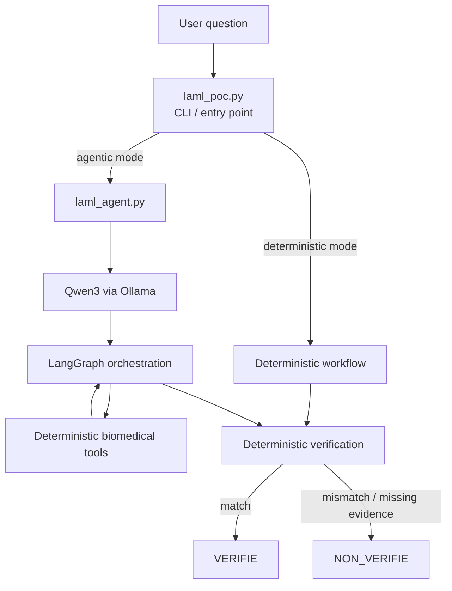

# Biomedical Agentic POC

> **Local and auditable agentic workflow for biomedical evidence verification**

This proof of concept explores how a **small local language model can orchestrate deterministic biomedical tools** while keeping scientific computation, evidence retrieval and verification outside the LLM.

The current demonstration uses the TCGA acute myeloid leukemia cohort (TCGA-LAML) and independently verifies the published frequency of **NPM1-mutated patients: 54/200 (27%)**.

The objective is not to build a biomedical chatbot, but to explore an architecture in which an LLM participates in scientific reasoning **without being trusted to generate the scientific result itself**.

---

## Why this project?

LLMs can be useful for planning and tool selection, but biomedical analyses require stronger guarantees around reproducibility, provenance and evidence.

This POC therefore separates four responsibilities:

- **LLM** — decides which action to perform;
- **deterministic Python tools** — perform scientific calculations;
- **source documents** — provide independent evidence;
- **deterministic verification** — compares calculated and published results.

A correct-looking LLM answer is not considered sufficient evidence.

---

## Scientific use case

The demonstration uses data associated with:

**The Cancer Genome Atlas Research Network.**  
*Genomic and Epigenomic Landscapes of Adult De Novo Acute Myeloid Leukemia.*  
New England Journal of Medicine. 2013;368:2059–2074.  
DOI: `10.1056/NEJMoa1301689`

The publication reports:

> **NPM1 — 54/200 (27%)**

The workflow asks:

> In the TCGA-LAML cohort reported in the 2013 NEJM paper, how many patients present an NPM1 mutation and what is the corresponding frequency?

The deterministic analysis independently obtains:

```text
54 / 200 = 27%
```

---

## Architecture



`laml_poc.py` is the command-line entry point. It can run the deterministic baseline directly or delegate agentic orchestration to `laml_agent.py`.

The LLM does **not** calculate the biomedical result.

Its role is restricted to selecting one action at a time from a predefined tool set.

---

## Agentic workflow

The local model can select among actions including:

```text
examiner_cohorte
compter_npm1
preuve_pdf
comparer
terminer
hors_perimetre
```

Model responses are constrained by a JSON schema.

A typical successful trajectory is:

```text
compter_npm1
      ↓
preuve_pdf
      ↓
comparer
      ↓
terminer
```

LangGraph maintains the state and implements the loop:

```text
decision → tool → decision → tool → ... → final
```

The model therefore controls **which available operation is executed next**, while the operations themselves remain deterministic.

---

## Separation of reasoning and computation

A central design choice is to keep scientific computation outside the LLM.

```text
              LLM
               │
         decides what to do
               │
               ▼
       deterministic tool
               │
      computes scientific result
               │
               ▼
        independent evidence
               │
               ▼
      deterministic comparison
```

This limits the consequences of hallucinated biomedical values.

The LLM can decide to invoke `compter_npm1`, but it cannot decide that the result is `54/200`.

That value must come from the underlying data-processing tool.

---

## Scientific result

The deterministic analysis obtains:

```text
NPM1 mutation records:          55
Unique NPM1-mutated patients:   54
Cohort denominator:            200

Frequency:                      27%
```

The distinction between mutation records and patients is intentional:

```text
55 NPM1 mutation records
          ↓
patient deduplication
          ↓
54 NPM1-mutated patients
```

Three cohort patients are absent from Supplemental Table 06:

```text
TCGA-AB-2815
TCGA-AB-2856
TCGA-AB-2944
```

They remain in the cohort denominator.

Importantly, **absence from Supplemental Table 06 is not interpreted as demonstrated wild-type status**.

---

## Independent documentary verification

The publication evidence is handled independently from the calculation.

The corresponding published result is:

```text
NPM1 54/200 (27)
```

Location:

```text
Table 1, continued
PDF page: 5
Printed page: 2063
```

The verifier therefore compares:

```text
DATA                         PUBLICATION

54 / 200                     54 / 200
   │                            │
   └──────── 27% = 27% ─────────┘
                │
                ▼
             VERIFIE
```

Verification is deterministic.

The LLM cannot declare a result verified by itself.

---

## Provenance

The workflow computes SHA-256 hashes for the local scientific inputs used during execution.

Example from the current analysis:

```text
SuppTable01.xlsx
c7273ff8267e4fe0e463afae84e0e3178acf9549cbdc0c955fc1e7c536aa5009

stdFreezeList.tsv
88204cb52a9be07c6af9ebdd20cdb7aa1b0307757d4f19d6154b046165764685

SupplementalTable06.tsv
240517ded00a43a434056fa616dd16a5c433ef235bfdadf0a4251efc04a14c4a

NEJMoa1301689.pdf
0efea6b7d069162b305615bfd648e5cf06de4f22805ab714eff1fe231f848b17
```

The original biomedical source files and publication PDF are intentionally not distributed in this repository.

---

## Agentic ablation experiment

An exploratory ablation experiment was performed to distinguish **LLM tool selection** from Python-generated routing.

### Guided configuration

In the initial configuration, the model received information about:

- completed tasks;
- available results;
- missing evidence;
- explicitly suggested useful tools;
- the overall workflow objective.

This makes tool selection strongly guided.

### Reduced-guidance configuration

The explicit list of suggested next tools (`outils_encore_utiles`) was removed.

The model therefore had to associate the current workflow state with the appropriate available action.

Using:

```text
Qwen3 1.7B
```

the observed trajectory was:

```text
compter_npm1
      ↓
preuve_pdf
      ↓
comparer
      ↓
terminer
```

Final status:

```text
VERIFIE
```

with:

```text
54 / 200 patients
27%
```

Example metrics from one recorded execution:

```text
Runtime:             357.127 s
Python max RSS:      ~62 MiB
Model:               qwen3:1.7b
Output protocol:     JSON schema
Simulation:          false
```

This experiment shows that **explicit Python-generated next-tool recommendations were not required for this successful run**.

It does **not** demonstrate unconstrained autonomous scientific planning.

The system prompt still defines the overall objective and the model operates inside a restricted action space.

---

## Small-model experiment

A smaller:

```text
Qwen3 0.6B
```

model was also tested under the more strongly guided configuration.

It did not successfully complete the workflow under the tested conditions.

This negative result is intentionally retained.

It suggests that reducing model capacity affected workflow orchestration under the current:

- prompt;
- JSON structured-output constraints;
- context configuration;
- local hardware environment.

This experiment is exploratory and does **not** establish that Qwen3 0.6B is intrinsically incapable of performing the task.

---

## Experimental provenance

The initial model experiments were performed during development **before the project was placed under Git version control**.

They are therefore documented retrospectively from retained outputs and development diagnostics.

No historical Git provenance is claimed for these initial runs.

The public repository establishes a version-controlled baseline for subsequent experiments.

Future experiments can associate:

```text
Git commit
    +
model and configuration
    +
prompt configuration
    +
LLM decisions
    +
tool outputs
    +
scientific input hashes
    +
final verdict
    +
runtime metrics
```

with each experimental run.

---

## Reliability principles

The POC implements several safeguards:

- local LLM inference;
- restricted tool vocabulary;
- JSON-schema-constrained model output;
- deterministic scientific calculations;
- no model-generated biomedical values used as evidence;
- independent documentary verification;
- explicit `VERIFIE / NON_VERIFIE` status;
- maximum number of agentic decisions;
- repeated-action detection;
- SHA-256 input provenance;
- diagnostic logging of model exchanges.

The architecture deliberately separates:

```text
decision
   ≠
scientific computation
   ≠
documentary evidence
   ≠
verification
```

---

## Running the POC

### Requirements

- Python 3
- Ollama
- a compatible local Qwen3 model

Install Python dependencies:

```bash
python3 -m venv .venv
source .venv/bin/activate

pip install -r requirements.txt
```

The biomedical source files are not distributed in this repository and must be placed in the expected local directories before running the complete scientific workflow.

Example invocation:

```bash
# Deterministic baseline
python laml_poc.py --mode deterministe \
  "Quel pourcentage de patients NPM1 mutés dans TCGA-LAML ?"

# Agentic orchestration with local Qwen3
python laml_poc.py --mode agentique --model qwen3:1.7b \
  "Quel pourcentage de patients NPM1 mutés dans TCGA-LAML ?"
```

---

## Current limitations

This is intentionally a **minimal proof of concept**, not a production biomedical agent.

### Scientific scope

The current workflow evaluates one question:

```text
TCGA-LAML
    +
NPM1 mutation frequency
    +
2013 TCGA AML publication
```

Generalization to other genes, cancers or publications has not yet been demonstrated.

### Data processing

The analysis uses author-provided TCGA annotations.

It does not reprocess sequencing reads or reproduce the complete original variant-calling pipeline.

### Agentic capability

The model operates within a constrained action space.

The reduced-guidance experiment demonstrates successful tool selection in one observed configuration, not open-ended autonomous scientific reasoning.

### Model benchmarking

The current comparison between Qwen3 0.6B and 1.7B is exploratory.

A rigorous benchmark would require:

- repeated runs;
- multiple biomedical questions;
- controlled prompt variants;
- additional models;
- success-rate measurements;
- latency measurements;
- memory measurements;
- systematic failure classification.

### Hardware

The project was intentionally developed on constrained local hardware.

In the recorded Qwen3 1.7B experiment, four model decisions required approximately:

```text
357 seconds
```

The deterministic Python component had a comparatively small memory footprint.

Local LLM inference is therefore the main computational bottleneck in the current setup.

---

## What this POC demonstrates

The project explores a simple design principle:

> **A biomedical agent does not need to be trusted with the scientific answer in order to participate meaningfully in scientific reasoning.**

A local LLM can act as a decision layer while deterministic tools retain responsibility for:

- computation;
- evidence;
- verification;
- provenance.

The resulting workflow is designed to remain:

**local · inspectable · provenance-aware · scientifically auditable**

---

## Next steps

Possible extensions include:

- systematic agentic ablation experiments;
- model-size benchmarking;
- multiple genes and cancer cohorts;
- retrieval-augmented scientific evidence;
- biomedical knowledge graphs;
- additional bioinformatics tools;
- controlled multi-agent specialization;
- contradictory-evidence handling;
- failure recovery;
- evaluation of robustness and explainability.

These extensions are deliberately outside the current minimal POC.

---

## Status

**Experimental proof of concept**

Current validated use case:

```text
TCGA-LAML / NPM1

54 / 200 = 27%

VERIFIE
```
